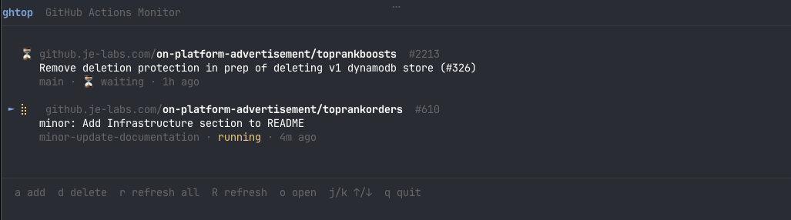

# ghtop

A terminal UI for monitoring GitHub Actions workflow runs. Pin specific runs across any number of repos and watch their status update live.

Built with [Bubble Tea](https://github.com/charmbracelet/bubbletea) and the [gh CLI](https://cli.github.com/).



## Requirements

- Go 1.21+
- [gh CLI](https://cli.github.com/) authenticated (`gh auth login`)

## Install

**Download a pre-built binary** from the [releases page](https://github.com/do4k/ghtop/releases) for your platform:

| Platform | File |
|----------|------|
| macOS (Apple Silicon) | `ghtop-darwin-arm64` |
| macOS (Intel) | `ghtop-darwin-amd64` |
| Linux x86-64 | `ghtop-linux-amd64` |
| Linux ARM64 | `ghtop-linux-arm64` |
| Windows x86-64 | `ghtop-windows-amd64.exe` |

```sh
# macOS / Linux example
chmod +x ghtop-darwin-arm64
mv ghtop-darwin-arm64 /usr/local/bin/ghtop
```

**Or install with Go:**

```sh
go install github.com/do4k/ghtop@latest
```

**Or build from source:**

```sh
git clone https://github.com/do4k/ghtop
cd ghtop
go build -o ghtop .
```

## Usage

Just run `ghtop`. Your pinned runs are saved to `~/.config/ghtop/pins.json` and restored on next launch.

### Key bindings

| Key | Action |
|-----|--------|
| `a` | Add a run (paste URL or `owner/repo/actions/runs/ID`) |
| `d` | Delete the selected run |
| `r` | Refresh all runs |
| `R` | Refresh selected run |
| `o` / `Enter` | Open selected run in browser |
| `j` / `↓` | Move down |
| `k` / `↑` | Move up |
| `q` / `Ctrl+C` | Quit |

### Adding a run

Press `a` and paste either a full URL or a short path:

```
https://github.com/owner/repo/actions/runs/12345678
owner/repo/actions/runs/12345678
```

GitHub Enterprise is supported — just paste the full URL and the hostname is extracted automatically. If you have a GHE host configured in `~/.config/gh/hosts.yml`, short-form inputs will default to that host.

## Auto-refresh

Pinned runs refresh automatically every 30 seconds.
